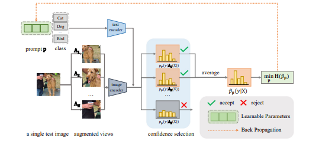

# project-for-deep-learning-course

requirements:
- pytorch
- torchvision
- transformers
- opencv-python
- scipy

# description
The code is adapted from the paper: https://arxiv.org/abs/2209.07511.

It was implemented as a project for a deep learning course.
My addition to the ideas expressed in the paper are:
- a smarter way of selecting the threshold for distributions, by using the mean and standard deviation of distributions' entropies to guide the choice
- a topk selection criterion
- different ways of augmenting images with spectral residual saliency

# usage
First, make sure the requirements are installed.
Then, make a directory in which the imagenet-a dataset is present, under the name of imagenet-a.
The code also scans for a README file in the dataset, which contains the necessary classes for zero-shot image classification.
Then, modify the config file as you want and run "python main.py" :)